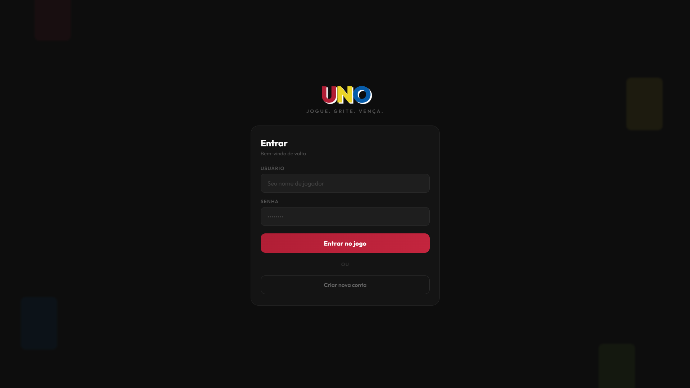
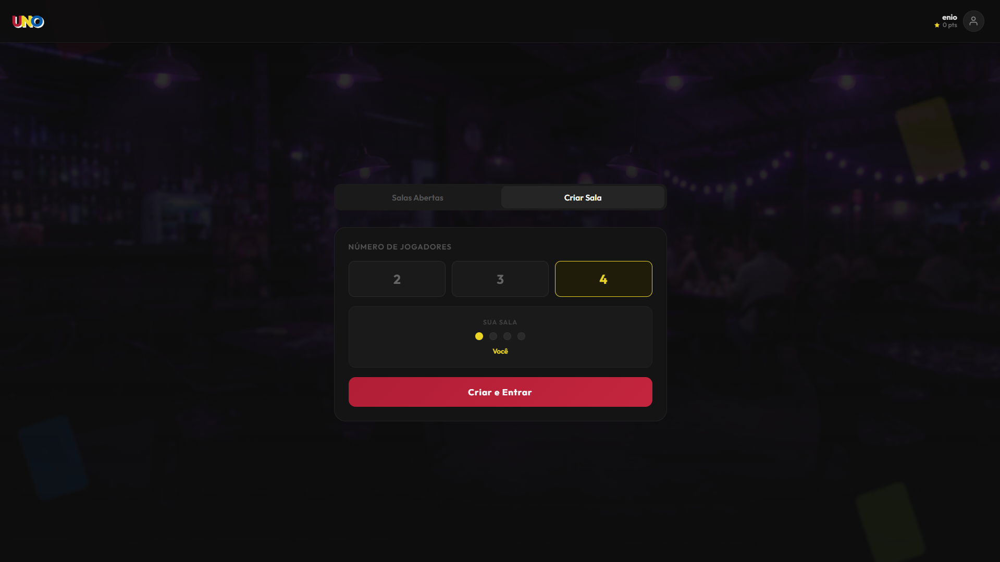
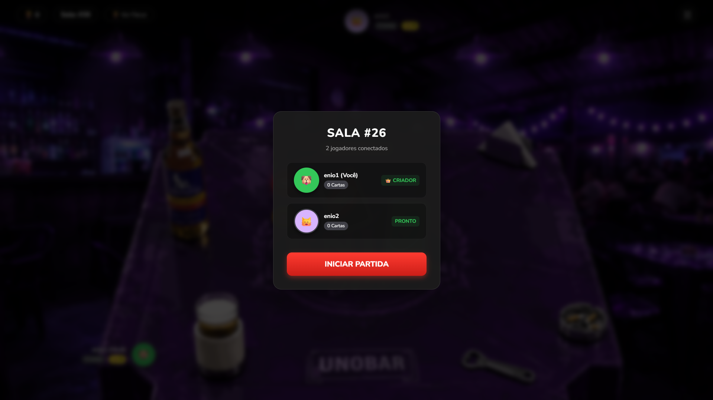

# 🍻 UNO-BAR - Real-Time Multiplayer Card Game

UNO-BAR é uma aplicação Full Stack de um jogo de cartas multiplayer em tempo real. Muito mais do que um jogo de navegador, este projeto foi desenvolvido com foco em **Alta Disponibilidade, WebSockets, Prevenção de Concorrência (Race Conditions) e Clean Architecture**.

## 📸 Interface (ENIO Bar)

| Gameplay | Login |
| :---: | :---: |
|  |  |
| **Lobby de Mesas** | **Sala de Espera (Room)** |
|  |  |

## Arquitetura e Decisões Técnicas

Para garantir uma experiência de jogo fluida e sem travamentos, a API foi construída não apenas como um CRUD, mas como um **Motor de Jogo Orientado a Eventos**.

*   **Comunicação Real-Time:** Utilização de `Socket.io` para emissão e escuta de eventos (jogadas, compra de cartas, gritar "UNO").
*   **Dead Man's Switch (Timer de Turnos):** Implementação de um timer no servidor (`setTimeout`) com **Grace Period** de 10.5 segundos, compensando a latência de rede (ping) do cliente.
*   **Prevenção de Race Condition:** Checagem rigorosa de estado e índices de turno antes de aplicar penalidades, garantindo que pacotes de rede atrasados não punam o jogador errado.
*   **Segurança (Zero Trust):** O backend não confia no cliente. Todas as jogadas passam por uma esteira de validação (compatibilidade de cores e símbolos) e o *payload* de entrada é tipado e sanitizado utilizando `Zod`.
*   **Engenharia de Software Pura:** Lógica de negócio isolada em *Services*, utilizando funções puras sem mutação de estado (ex: algoritmo *Fisher-Yates* para embaralhar o deck garantindo aleatoriedade matemática).

## Tecnologias Utilizadas

**Backend:**
*   Node.js & Express
*   Socket.io (WebSockets)
*   PostgreSQL & Sequelize (ORM)
*   JWT (JSON Web Tokens) para Autenticação
*   Zod (Validação de Schemas)
*   Jest (Testes End-to-End simulando requisições REST)

**Frontend:**
*   React.js (Vite)
*   Context API & Custom Hooks para gerência de estado do jogo

## Como Executar Localmente

### Pré-requisitos
*   Docker & Docker Compose
*   Node.js (v18+)

### Passo a Passo

1.  Clone o repositório:
    ```bash
    git clone [https://github.com/eniomartinst/UnoBar.git](https://github.com/eniomartinst/UnoBar.git)
    ```
2.  Suba a infraestrutura (Banco de Dados) via Docker:
    ```bash
    docker-compose up -d
    ```

3.  Configure as variáveis de ambiente:
    *   Crie um arquivo `.env` na raiz do backend baseando-se no `.env.example`.

4.  Inicie a API REST e o Servidor Socket:
    ```bash
    cd UnoApi
    npm install
    npm run dev
    ```

5.  Inicie o Frontend:
    ```bash
    cd UnoFront
    npm install
    npm run dev
    ```

## Cobertura de Testes
O projeto conta com uma suíte de testes E2E (End-to-End) automatizados construídos com **Jest**. Os testes validam o ciclo de vida completo de uma partida via API REST (Registro, Login, Proteção de Rotas, Criação de Sessão, Busca de Lobby e Deleção de Sala).

---

## 👨‍💻 Autor

**Ênio Martins**
*Full Stack Developer*

* [GitHub](https://github.com/eniomartinst)